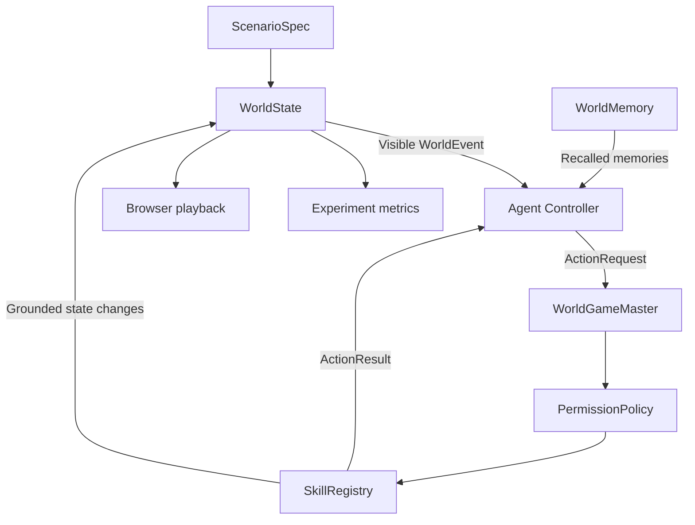

# Riverbend Agent World Architecture

## 1. 分层结构

LLM 不拥有 `WorldState`。LLM 只能返回一个 `ActionRequest`。所有状态变化都
必须经过 `PermissionPolicy` 和确定性 Skill handler。

## 2. 通用数据契约

`core/models.py` 定义：

- `AgentSpec`：身份、角色、目标、初始位置、记忆和允许动作。
- `LocationSpec`：地点及其公开描述。
- `ActionSpec`：动作类型、必需参数、可选参数和角色限制。
- `WorldEvent`：轮次、来源、地点、受众、可见性和来源元数据。
- `ScenarioSpec`：一个场景的静态定义。
- `SimulationConfig`：运行轮数、种子、条件和模型信息。
- `ActionRequest`：Agent 的动作提议。
- `ActionResult`：GM 的接受或拒绝以及状态变化。
- `WorldState`：位置、公共变量、关系和事件历史。

这些对象都能转换成 JSON，后端、实验器和网页使用同一份数据。

## 3. Agent 行为循环

`SimulationRunner` 每轮按指定顺序执行每个 Agent：

1. 根据 `is_public` 和 `audience` 计算新观察。
2. 将新事件写入该 Agent 的独立记忆。
3. 用目标、当前位置、新事件和记忆构造 Turn Context。
4. Scripted 或 LLM Controller 提出一个动作。
5. GM 验证 Agent、角色、Skill、参数、轮次和领域规则。
6. 接受时更新世界并生成事件，拒绝时世界保持不变。
7. Agent 接收 `ActionResult`；LLM Controller 将它作为
   `previous_action_result` 写入下一轮 Prompt。
8. Agent 根据接受/拒绝状态和原因修正下一动作。
9. 保存该 Turn 后的完整状态快照。

同一轮中，前一个 Agent 的公开事件可以被后续 Agent 看见。私聊只对发送者
和收件人可见。

## 4. Skill 和权限

当前 Skill：

| Skill | 硬规则 |
|---|---|
| `move` | 目的地必须存在，不能移动到当前位置 |
| `speak` | 频道必须为 public/private，收件人必须存在 |
| `inspect` | 只能调查当前位置 |
| `vote` | 必须在 town_hall，只能投一次，只能选择合格候选人 |

`LLMWorldController` 返回未知 Skill、漏参数或多参数时，不会修改世界。GM
会生成拒绝结果并保留审计记录。拒绝原因在下一轮作为权威反馈返回该 Agent，
但不会替 Agent 自动选择动作或放宽硬规则。

## 5. 记忆与社会传播

`WorldMemory` 为每个 Agent 保存独立记忆库：

- `episodic`：移动、投票等个人经历。
- `semantic`：公告、实验信息和调查得到的事实。
- `social`：公开发言和私聊消息。

每条记忆保存 `event_id`、`source_agent_id` 和 `source_event_id`。Agent
只能转述自己可见的事件。检索分数由语义相关性、近期性和重要性组成。

真实多轮运行默认使用
`sentence-transformers/paraphrase-multilingual-MiniLM-L12-v2` 的量化 ONNX
版本，通过 FastEmbed 在本地生成 384 维向量。模型文件位于
`models/fastembed/`，运行时使用 `local_files_only=True`，不会联网。
`HashingTextEmbedder` 仍用于确定性测试、网页脚本演示和模型缺失时的显式
降级路径。

私聊会增加参与者之间的互动关系值。这个值当前表示互动熟悉度，不自动等同于
信任或赞同。

## 6. 科学实验

`build_experiment_plan`：

- 使用固定 base seed。
- 打乱条件执行顺序。
- 为每次运行生成独立 seed。
- 打乱 Agent 行动顺序。
- 在每个条件内部平衡 Alice/Bob 首位顺序。

`run_scripted_experiment_plan` 会实际执行每一个计划单元。分析器检查实验信息
是否被全部 Agent 观察，并统计动作接受率、消息、投票、关系和记忆类型。

正式 Live 选举使用 `start_at_voting_location=True`，使投票地点不再成为
信息处理效应的混杂因素。通用世界与脚本演示继续使用分散地点。Live CLI 的
`auto` 候选人顺序由 seed 奇偶决定；场景构建器按该顺序重排真实公告段落，
而不只是改 metadata。指标同时保存合格选民数、有效选票数、未投票人数和
未投票 Agent ID。

固定 Persona 的多次运行是对模型过程的重复采样，不是增加人类样本量。

## 7. 网页

`web/src/app.ts` 读取完整 `SimulationRun`：

- Canvas 绘制 Riverbend 地图、道路、河流、地点和 Agent。
- 每个 Turn 使用 `state_after` 回放真实世界状态。
- 支持播放、暂停、单步、重置、时间线和速度。
- Live 10+1 协议读取 `time_unit` 元数据，以“第 X 天”展示日程、事件和
  模型轨迹。
- 支持切换四个条件。
- Agent 面板显示位置、目标、背景、关系和当前轮次可见记忆。
- 事件面板区分公告、实验信息、移动、调查、公开发言、私聊和秘密投票。
- 事件面板使用独立滚动区，不会因长期运行的事件数量增长而挤压地图。
- 投票面板集中显示投票人、候选人、日期和同一次动作返回的第一人称理由。
- 实验区显示平衡计划生成的脚本汇总。
- 实验柱形图以全部合格 Agent 为分母，显示 Alice、Bob 和未投票人数。

`scripts/build_world_html.py` 将 CSS、编译后的 JavaScript 和 JSON 数据嵌入
一个 HTML 文件，因此网页演示不需要 API、服务器或联网。

## 8. 真实模型边界

`scripts/run_live_world.py` 通过现有 DeepSeek adapter 创建 5 个
`LLMWorldController`。程序要求 `--confirm-live-api`，并保存所有控制器
轨迹、provider token 用量以及实际记忆 Embedder 名称。DeepSeek 负责动作
提议，本地 ONNX 模型只负责记忆检索，两者是相互独立的模块。

默认 Live Run 使用 10+1 协议：seed 决定 10 个生活日的本地随机事件，
`RiverbendDayScheduler` 在每天开始时广播事件并切换 GM 的阶段权限；第
10 天加入实验操纵，第 11 天统一进入 Town Hall 并开放选票账本。完整事件
日程会写入运行 JSON，方便复核和跨条件配对。

`scripts/run_four_condition_world.py` 将一份已验证 baseline 与另外三种信息
条件组成最小四组实验。它在付费运行前比较 seed、候选人顺序、生活天数、
事件日程、Agent 顺序、记忆模型和语言模型；每组完成后增量保存批次清单，
其中包含源文件、得票、逐 Agent 票变、操纵检查和模型用量。

当前没有运行这条命令。真实模型行为、成本、延迟和输出稳定性仍需单独审核。
